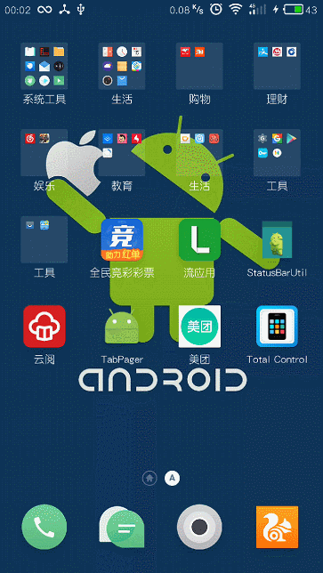

# `TabPager`


> `TabPager`不仅集成了`TabLayout`和`ViewPager`为顶部选项卡页面，也集成了`RadioGroup`和`ViewPager`为底部导航栏页面，还封装了根据具体页面根据不同的加载状态而显示不同页面的功能，也可以自定义这些页面和其他一些属性。如果某个页面加载数据不成功，切换到其他页面再回来时，框架会自动调用重试加载功能；如果加载成功了，则不再重试加载。

### 1. 运行效果

* 屏幕截图（`gif`录制卡顿，实际运行流畅）：



* Demo下载体验，[`TabPager`](https://fir.im/tpq72p) ，或者扫描二维码下载

  


### 2. 依赖

```groovy
dependencies {
  //1.0.3版本之前，不含底部导航栏
  compile 'com.yhy:tpg:latestVersion'
  
  //1.0.5版本及之后，加入了底部导航栏
  compile 'com.yhy.widget:tabnav:latestVersion'
}
```

### 3. 使用说明

* 顶部选项卡页面控件[`TpgView`](./doc/TpgView.md)
* 底部导航栏页面控件[`NavView`](./doc/NavView.md)

### 4. 嵌套使用

> 嵌套使用使用方法跟普通使用一样，唯一需要注意的是创建适配器时的`FragmentManager`，如果是一级`Fragment`的话，需要传入`getSupportFragmentManager()`，否则只能是`getChildFragmentManager()`

```java
//mAdapter = new PagersAdapter(getFragmentManager());
/*
//这里需要用getChildFragmentManager()

getChildFragmentManager()是fragment中的方法, 返回的是管理当前fragment内部子fragments的manager.
getFragmentManager()在activity和fragment中都有.
在activity中, 如果用的是v4 support库, 方法应该用getSupportFragmentManager(),返回的是管理activity中fragments的manager.
在fragment中, 还叫getFragmentManager(), 返回的是把自己加进来的那个manager.
也即, 如果fragment在activity中, fragment.getFragmentManager()得到的是activity中管理fragments的那个manager.如果fragment是嵌套在另一个fragment中, fragment.getFragmentManager()得到的是它的parent的getChildFragmentManager().
总结就是: getFragmentManager()是本级别管理者, getChildFragmentManager()是下一级别管理者.
这实际上是一个树形管理结构.
*/
mAdapter = new PagersAdapter(getChildFragmentManager());
tpgView.setAdapter(mAdapter);
```

### 句终

> 哈哈。。